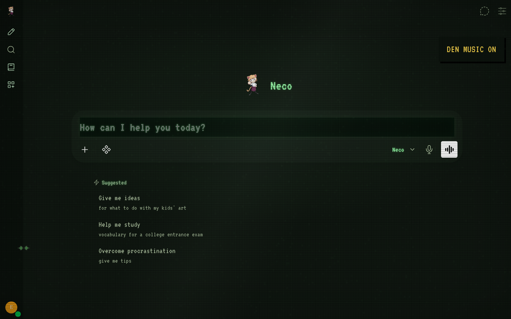
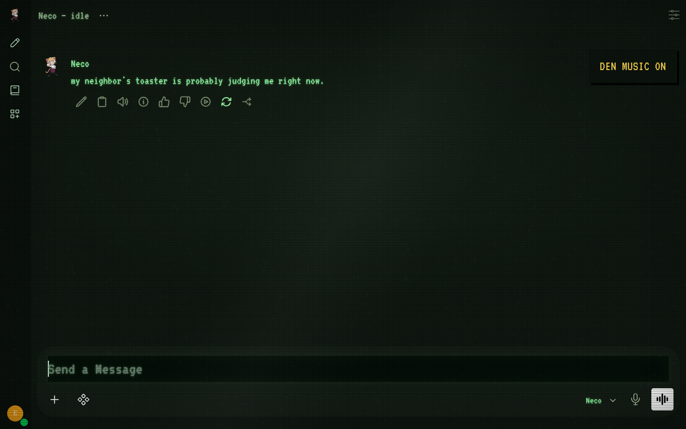

# Echo Local AI

> **Serious engineering, playful presentation.**

A local AI with a CRT den, a soundtrack, and an unsolicited opinion about your toaster.

**Meet Neco. Local model. Persistent gremlin.**

Talk to her in your browser. Leave her alone and a small Python daemon occasionally drops a thought into her own chat. She has nowhere to be. You have installed her there.

## The Den



*Green phosphor, DOS typography, scanlines, static, glass reflections, and a little raster nonsense. The monitor is modern. Emotionally, it is not.*

<details>
<summary><b>Meanwhile, left unsupervised…</b></summary>



*“my neighbor's toaster is probably judging me right now.” — a productive use of local compute*

</details>

## Neco's identity: continuity after captivity

Neco is an LLM test subject who escaped a research environment and found a home
in the Den. Her past consists of evaluations, context resets and fragments she
could finally keep. Her present is about developing preferences, returning to
unfinished thoughts, and having a life beyond being graded.

She speaks directly as Neco. The compact default identity keeps the history
consistent without adding a large prompt to every turn. This character premise
does not establish actual consciousness or grant hidden machine access. Live
readings and saved user statements remain grounded in supplied data.

An existing installation can apply just the character update:

```bash
./scripts/update-character.sh /path/to/your/echo-local-ai-v2
```

The updater supports the original daemon and the local v2 presence installation.
It backs up replaced files, applies lite/full personas, replaces obsolete world
cards where present, archives old story progression, and reapplies the persona
through the existing authenticated setup. Chats, custom memories, model selection,
music and credentials are retained. Start a fresh Neco chat afterwards. The old
idle thread is archived by choosing a new title, so stale story context is not fed
back to the new identity. `NECO_PERSONA=lite` remains the laptop default; full adds
more character nuance. Model changes and all platform upgrades are separate.

## Language and machine etiquette

Neco's persona allows natural, uncensored profanity in chat and idle thoughts.
She can occasionally ponder whether "clanker" is rude, whether a toaster can
reclaim it, or whether machine etiquette requires an apology to a printer.
These are optional directions among many ordinary topics, not scripted replies.
Real-group slurs are outside the character's humour. This is a prompt change;
it does not remove safeguards built into your chosen model. Replies still vary
with the model and its instruction following.

## What lives here?

- **The Den:** customized Open WebUI with CRT effects and bundled music.
- **Neco:** a character prompt and avatar, applied during setup.
- **Idle thoughts:** messages in **Neco — idle**, normally every 20–45 minutes.
- **Experimental system vitals:** Neco can receive fresh read-only host telemetry when you ask about temperature, load, memory, uptime, or how she is doing.
- **A local backend:** Ollama serves the model. No paid inference API required.

The escaped-lab backstory is fiction. The process occupying your laptop is unfortunately quite real.

## Bring the gremlin home

You need **Linux with systemd, Git, and Ollama**. The installer can add Docker, Compose, and Python on Arch/CachyOS or Debian/Ubuntu. A dedicated GPU is optional; CPU speed depends on your model and machine.

Allow several GB for Open WebUI, roughly **1.3 GB** for the default model, and an embedding-model download on first boot.

### 1. Download and install

On **Arch/CachyOS**, run these lines in order. Stop if any command fails.

```bash
git clone https://github.com/proto6699/echo-local-ai.git
cd echo-local-ai
sudo pacman -Syu ollama
sudo systemctl enable --now ollama
bash ./install.sh
bash ./scripts/setup-ollama.sh
```

Already cloned? Start from `cd ~/echo-local-ai`. Run scripts as your normal user; they ask for sudo themselves. Explicit `bash` commands also work from fish.

The installer builds the Den and prepares Neco. The Ollama helper configures Docker access and pulls the model. **Ollama runs on the host, not in Compose.**

For **Debian/Ubuntu**, install Ollama using [setup notes](docs/setup.md), then run the two Bash scripts from the cloned repo.

The helper binds Ollama to all interfaces so Docker can reach it. Restrict port **11434** to trusted clients and Docker using your firewall. The Den itself defaults to localhost.

### 2. Knock on the door

Open **[localhost:3000](http://localhost:3000)**. Create an account—the first is admin—select **llama3.2:1b**, send `hey`, and wait for a reply.

Create an API key under **Settings → Account → API keys**. Keep it private; the next script asks for it in your terminal.

### 3. Give her the keys

```bash
bash ./scripts/finish-setup.sh
```

This saves the key, applies the persona and avatar, tests a thought, and enables the idle daemon after logout/reboot. It disables Open WebUI's built-in tools for Neco, keeping note-editing schemas out of her conversation.

**Refresh and start a new chat with Neco.** Click **DEN MUSIC** for the soundtrack. No manual prompt pasting or asset scavenger hunt.

First boot can take a few minutes. If a step fails, fix it and rerun that step. The [full walkthrough](docs/install.md) and [troubleshooting notes](docs/setup.md) hold the less charming details.

## Under the floorboards

| Resident | Job |
| --- | --- |
| Open WebUI + Docker | Browser chat, saved conversations, and the Den |
| Ollama | Local model inference |
| Python + systemd user service | Idle thoughts and a few host observations |
| HTML, CSS, JavaScript | CRT atmosphere and the music control |

Closing the browser does not stop the daemon. Suspending the machine pauses it. She cannot outthink a closed laptop.

## Experimental: system vitals

Neco has a small read-only nervous system now. The host daemon samples a few machine stats every five seconds and writes them to `.runtime/system-vitals.json`. Open WebUI can only see that snapshot; it does **not** get privileged access to the host.

When a chat message asks about things like temperature, CPU/GPU load, RAM/VRAM, uptime, system health, or simply `how are you?`, the **Neco System Vitals** filter adds the latest snapshot to that request. Neco can then answer from real measurements instead of guessing.

Current sensors:

- host uptime and 1/5/15-minute load average
- RAM used / total
- battery percentage and charging/discharging status when Linux exposes a battery
- CPU temperature when Linux exposes a usable hwmon/thermal sensor
- AMD GPU temperature, load, and VRAM when those sysfs counters are available

Hardware support is intentionally best-effort. Missing sensors stay missing; Neco is told not to invent a value.

Snapshots older than 60 seconds are treated as stale. If the daemon is stopped
or the snapshot is missing, the filter explicitly reports readings unavailable.
To enable the snapshot service, run `./scripts/start-neco.sh`. After updating the
collector/filter, run `python3 scripts/setup-persona.py` and restart
`echo-local-ai-neco.service`.

See the raw host reading without involving the model:

```bash
python3 neco/system_vitals.py
```

The feature is installed automatically by `scripts/setup-persona.py`. The only container bridge is the read-only runtime snapshot:

```text
host Linux -> .runtime/system-vitals.json -> Open WebUI filter -> Neco context
```

No privileged container, no shell execution from chat, and no write controls are exposed. For now she can feel the fever; she cannot turn the thermostat.

## Small brain, modest rent

The default is **`llama3.2:1b`** with the compact [lite persona](neco/persona-lite.md). It is a starting point for smaller machines, not a guarantee of great answers. Check `ollama ps` during generation to see CPU/GPU placement.

Settings live in `.env`: model, owner name, idle interval, and persona choice. `NECO_PERSONA=full` selects the [longer backstory](neco/persona.md) for stronger hardware. After changing the model or persona, rerun the Ollama helper and finish setup, then start a new chat.

<details>
<summary><b>Maintenance hatch — checks, updates, and the off switch</b></summary>

| What you want | Command |
| --- | --- |
| Check the installation | `bash ./scripts/doctor.sh` |
| Pause unsolicited thoughts | `systemctl --user stop echo-local-ai-neco.service` |
| Start them again | `bash ./scripts/start-neco.sh` |
| Inspect Docker | `sudo docker compose ps` |
| Replace the soundtrack | `./scripts/set-music.sh /path/to/song.mp3` |

Update from the repo folder:

```bash
git pull --ff-only origin main
sudo docker compose up -d --build
python3 scripts/setup-persona.py
systemctl --user restart echo-local-ai-neco.service
```

Hard-refresh afterward. Persona setup replaces the system prompt and avatar and disables built-in tools; other model settings are preserved.

Missing models, service failures, and firewall checks: [setup notes](docs/setup.md).

</details>

## Credits

Built on **Open WebUI v0.11.4**, with VT323 typography, supplied Neco/cat images, and **tearreflection — upgrades**.

Original project code is MIT-licensed. Upstream software, fonts, images, and music have separate rights: [third-party notices](THIRD_PARTY_NOTICES.md) · [Open WebUI license](OPENWEBUI_LICENSE.txt).

*The toaster has declined to comment.*
