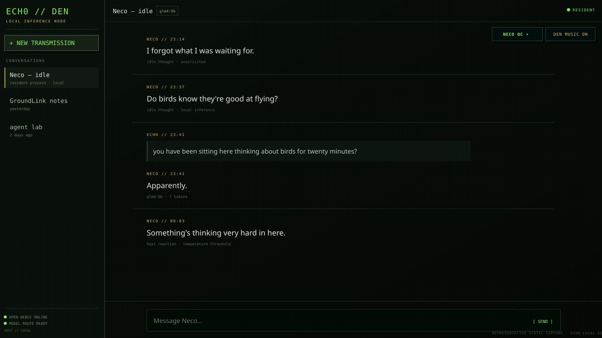
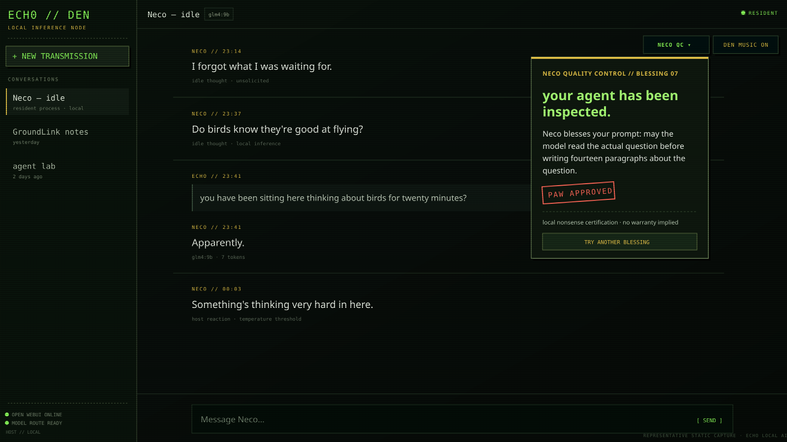

# Echo Local AI

> **local model. persistent gremlin. considerably too aware of the computer it's running on.**

this started with a fairly simple question:

**what happens if a local model doesn't disappear when you close the chat?**

not "sentient AI." not an agent army. not another assistant waiting politely for a prompt.

just a small process that stays on the machine, notices a few things, remembers a little, gets bored, and occasionally decides it has something to say.

that thing became **Neco**.

---

## the idea

most local AI setups are basically:

```text
human asks thing
      ↓
model wakes up
      ↓
model answers thing
      ↓
model waits for the next prompt
```

Neco is me poking at that last part.

she runs as a small Linux daemon on the host. every so often she generates a thought and drops it into her own Open WebUI conversation.

sometimes the thought has something to do with the machine.

sometimes it absolutely does not.

```text
host machine
    │
    ├── time
    ├── uptime
    ├── temperature
    └── network
          │
          ▼
        Neco
          │
          ├── react to something occasionally
          ├── think about Echo
          ├── wonder about drones
          ├── question some human nonsense
          └── forget what she was saying
          │
          ▼
      local model
          │
          ▼
      Open WebUI
          │
          ▼
      "Neco — idle"
```

the machine state is context, not the personality.

---

## neco

Neco is a fictional AI persona.

dry. mildly sharp. slightly suspicious. not particularly interested in performing helpfulness every second of her existence.

```text
That song again.
```

```text
Why do humans call software "running"?
Nothing's going anywhere.
```

```text
I forgot what I was waiting for.
```

if the network genuinely disappears:

```text
Oh.
The outside disappeared.
```

and then comes back:

```text
There you are.
```

the illusion of continuity is just:

```text
timers + state + sensors + local inference + unsolicited messages
```

which turns out to be considerably more interesting than it sounds.

---

## the den

Neco lives inside a customized Open WebUI interface I call **the Den**.

Open WebUI still does the useful work underneath — authentication, chat storage, model routing and the API — while the frontend has been attacked with enough CSS and JavaScript to feel like an old CRT somebody forgot to turn off.

scanlines. glow. static. jitter. terminal typography. Den radio. Neco controls.

normal software underneath.

mildly haunted appliance on top.

---

## screenshots

representative static captures built from the Den theme shipped in `openwebui/overlay/index.html`. the chat text below is example data, not a dump of anyone's live chat history.

### the den + Neco idle chat

<p align="center">
  
</p>

### Neco QC

<p align="center">
  
</p>

---

# install

the project currently targets **Linux**.

the original machine is a repurposed AMD BC-250 running CachyOS, but nothing about the basic setup requires a BC-250.

## requirements

- Git
- Docker + Docker Compose
- Python 3
- Python venv support
- systemd user services
- a model that Open WebUI can talk to

if Docker / Compose / Python venv support is missing, `./install.sh` can bootstrap those pieces automatically on Arch/CachyOS/EndeavourOS and Debian/Ubuntu.

Neco talks to **Open WebUI**, not directly to Ollama/LM Studio/llama.cpp.

---

## 1. clone it

```bash
git clone https://github.com/proto6699/echo-local-ai.git
cd echo-local-ai
```

## 2. run the installer

```bash
./install.sh
```

the installer:

```text
checks dependencies
      ↓
creates .env
      ↓
creates Neco's venv
      ↓
installs Python deps
      ↓
builds the Den
      ↓
starts Open WebUI
      ↓
installs Neco's user service
```

it deliberately **does not start Neco yet**.

she needs an Open WebUI account, a working model, and an API key first.

## 3. open the den

```text
http://localhost:3000
```

create the initial Open WebUI account.

if 3000 is already occupied, edit `.env`:

```env
OPENWEBUI_PORT=3001
```

and rerun:

```bash
docker compose up -d --build
```

## 4. connect a model

make sure normal Open WebUI chat works first.

```text
Neco
  ↓
Open WebUI
  ↓
your model provider
  ↓
local model
```

the default is:

```env
NECO_MODEL=qwen2.5:0.5b
```

change it to the model name Open WebUI actually exposes on your machine.

## 5. give neco an API key

create an Open WebUI API key for the account Neco should use, then:

```bash
./scripts/set-token.sh
```

the token is kept in:

```text
.runtime/neco_token
```

and ignored by Git.

## 6. test her

```bash
./scripts/test-neco.sh
```

this generates one thought and exits.

you should now have a chat called:

```text
Neco — idle
```

## 7. let her stay

```bash
./scripts/start-neco.sh
```

check:

```bash
systemctl --user --no-pager status echo-local-ai-neco.service
```

watch:

```bash
journalctl --user -u echo-local-ai-neco.service -f
```

by default she waits roughly **20–45 minutes** between thoughts.

because receiving a message every eleven seconds from the thing living in your computer would get old remarkably fast.

---

## configuration

```env
OPENWEBUI_PORT=3000
NECO_MODEL=qwen2.5:0.5b
NECO_CHAT_TITLE="Neco — idle"
NECO_MIN_INTERVAL=1200
NECO_MAX_INTERVAL=2700
OWNER_NAME=Echo
NECO_MACHINE="this machine"
```

---

## model backend (ollama)

these instructions are for a Linux host with systemd. the fresh-install report came from a CachyOS laptop. the BC-250 is where this started, not a hardware requirement.

on Arch/CachyOS, install the backend with a full system upgrade:

```bash
sudo pacman -Syu ollama ollama-vulkan
```

`ollama-vulkan` is the backend used in the laptop report. installing it does not prove GPU acceleration is working. while a model is loaded, run `ollama ps` and inspect the processor column.

on Debian/Ubuntu, use the [upstream Linux installer](https://docs.ollama.com/linux):

```bash
sudo apt-get update
sudo apt-get install -y curl
curl -fsSL https://ollama.com/install.sh -o /tmp/ollama-install.sh
less /tmp/ollama-install.sh
sh /tmp/ollama-install.sh
```

let the container reach Ollama on the host. this avoids the systemd editor's disappearing-comment trap. if you already have an `override.conf`, preserve its other settings when adding this environment line; the command below replaces that file.

```bash
sudo mkdir -p /etc/systemd/system/ollama.service.d
printf '[Service]\nEnvironment="OLLAMA_HOST=0.0.0.0:11434"\n' | sudo tee /etc/systemd/system/ollama.service.d/override.conf
sudo systemctl daemon-reload
sudo systemctl enable --now ollama
sudo systemctl restart ollama
systemctl --no-pager show ollama -p Environment
```

that last restart matters if Ollama was already running. see the [upstream networking instructions](https://docs.ollama.com/faq). binding to all interfaces also makes the unauthenticated Ollama API reachable from other networks unless the host firewall restricts it. allow the Docker subnet below, not the whole internet.

start small:

```bash
ollama pull qwen2.5:0.5b
ollama list
sed -i 's/^NECO_MODEL=.*/NECO_MODEL=qwen2.5:0.5b/' .env
```

`NECO_MODEL` must exactly match the name in `ollama list`, and that model must be visible to Neco's account in Open WebUI. changing `.env` does not download a model. rerunning the installer preserves your existing choice. after changing models on an already running setup:

```bash
systemctl --user restart echo-local-ai-neco.service
```

## model sizes

approximate model downloads, separate from Docker and the embedding model. tags and download sizes can change; these are not RAM/VRAM requirements.

| model | download | purpose |
| --- | --- | --- |
| `qwen2.5:0.5b` | about 0.4 GB | default smoke test; worked in the laptop report |
| `llama3.2:3b` | about 2 GB | candidate for everyday use; not validated in that report |
| `qwen2.5:3b` | about 2 GB | another everyday candidate; not validated in that report |
| `glm4:9b` | about 5.5 GB | previous default; heavier download and memory demand |

the tiny model proves the plumbing works. it does not promise particularly convincing gremlin literature. the 3B options should give the persona more room, but still need a real test. avoid small `qwen3` reasoning models for now: reasoning text may leak into messages; that path is not validated here.

## connecting the den to ollama

Compose now seeds `OLLAMA_BASE_URL` with `http://host.docker.internal:11434`. existing Open WebUI volumes can retain their saved connection settings instead; see [upstream configuration](https://docs.openwebui.com/reference/env-configuration/).

in **Admin Settings → Connections**, enable the Ollama API, set that URL, verify, and save. then select the model and confirm ordinary chat works. create the API key under **Settings → Account → API keys** before running `./scripts/set-token.sh`.

if host Ollama works but the container times out, inspect the actual Docker subnet:

```bash
sudo docker inspect echo-local-ai-webui --format '{{range $name, $net := .NetworkSettings.Networks}}{{$name}}{{"\n"}}{{end}}'
# replace NETWORK_NAME with the name printed above:
sudo docker network inspect NETWORK_NAME --format '{{range .IPAM.Config}}{{.Subnet}}{{"\n"}}{{end}}'
```

with active ufw, the laptop was fixed by:

```bash
sudo ufw allow from 172.16.0.0/12 to any port 11434 proto tcp
sudo ufw reload
```

that range covers common Docker bridge subnets. prefer replacing it with the actual subnet printed above; custom Docker networks may be outside that range. the installer does not change your firewall.

for firewalld, an **untested, port-scoped alternative** is below; replace the source with your actual Docker subnet before applying:

```bash
sudo firewall-cmd --permanent --zone=public --add-rich-rule='rule family="ipv4" source address="172.16.0.0/12" port port="11434" protocol="tcp" accept'
sudo firewall-cmd --reload
```

use the zone handling traffic to the host (`sudo firewall-cmd --get-active-zones`). putting that entire source range in `trusted` is broader: it permits all ports, so it is not the default suggestion here. firewall setups differ; rerun the container check after any change.

the Den itself now binds to `127.0.0.1` by default. for deliberate LAN access, set `OPENWEBUI_BIND=0.0.0.0` in `.env` and recreate with `sudo docker compose up -d`. the Ollama listener is a separate setting.

## first boot notes

bring a connection with some patience. preferably one that is not billing you by the sigh.

- the pinned Open WebUI base image is several GB. the installer warns and tries the pull up to three times, five seconds apart. completed layers remain cached.
- first boot also downloads the `sentence-transformers/all-MiniLM-L6-v2` embedding model from Hugging Face (around 30 files in the laptop report). `(unhealthy)` for a few minutes can be normal during this download; on a slow connection it can take longer.
- Ollama model downloads are additional. the installer does not pull them for you.

check progress rather than rebuilding repeatedly:

```bash
sudo docker compose ps
sudo docker compose logs --tail=100 openwebui
curl -sS -m 5 http://localhost:3000/health
```

use your configured port if different. a 200 response means the health endpoint is ready; it does not prove the model connection works. persistent download errors or an unhealthy state after downloads finish need investigation.

## troubleshooting

### image pull times out

retry the pinned image separately, then rerun the installer:

```bash
until sudo docker pull ghcr.io/open-webui/open-webui:v0.11.4; do sleep 5; done
./install.sh
```

this manual loop keeps retrying until success; Ctrl-C stops it. layers already downloaded are reused. optionally merge `"max-concurrent-downloads": 1` into `/etc/docker/daemon.json` as valid JSON, preserving existing settings, then `sudo systemctl restart docker`. this may help weak links but was not confirmed in the laptop test; restarting Docker can interrupt other containers.

### pacman 404s or invalid signatures

an out-of-sync CachyOS mirror/database caused these in the reported install:

```bash
sudo cachyos-rate-mirrors
sudo pacman -Syu
sudo pacman -S ollama ollama-vulkan
```

use a full upgrade, not `pacman -Sy` followed by individual packages. on other Arch systems, refresh mirrors using that distribution's tooling. if signature errors persist after synchronization, investigate the keyring/package error; do not disable signature verification.

### no models in the den

```bash
curl -sS -m 5 http://localhost:11434/api/tags
./scripts/doctor.sh
```

if the host passes but the container request times out, check the listener and firewall section above. the doctor uses Python `urllib` inside the container with a five-second timeout, so it works without curl and reports failures. when using curl yourself, use `-sS -m 5`; `-s` alone hides useful errors. if connectivity passes, verify and save the Admin Connections URL and check model access for your account.

### Docker permission denied

use `sudo docker compose ...` for manual Docker commands when your user cannot access the socket. the installer and doctor handle this through sudo; do not run the whole installer or doctor as root, since Neco belongs to your user session. optionally add your account to the `docker` group and log out/in; that group grants root-equivalent Docker access.

### buildx plugin not found

in the laptop test this was a warning and the build still succeeded. if Compose actually fails the build, install your distribution's Docker Buildx plugin and retry; a failed build is not something to ignore.

### systemctl looks frozen

it is probably a pager. press `q`. use `--no-pager`, as in `systemctl --no-pager show ollama -p Environment`, or run `export SYSTEMD_PAGER=` in a Bash session.

### neco disappears at logout or sleep

`./scripts/start-neco.sh` already enables the user service. `loginctl enable-linger "$USER"` keeps the user service manager around after logout and starts it at boot. suspend/sleep still pauses Neco's timers; linger cannot keep a sleeping laptop awake.

## starting on boot

after the account, model, token, and one-shot test work, run these as your normal login user:

```bash
sudo systemctl enable --now docker ollama
loginctl enable-linger "$USER"
./scripts/start-neco.sh
./scripts/doctor.sh
```

Compose uses `restart: unless-stopped`. a container you deliberately stopped stays stopped; start it again with `sudo docker compose up -d`.

verify, and repeat these checks after your next reboot:

```bash
systemctl --no-pager is-enabled docker ollama
systemctl --no-pager is-active docker ollama
systemctl --user --no-pager is-enabled echo-local-ai-neco.service
systemctl --user --no-pager is-active echo-local-ai-neco.service
loginctl --no-pager show-user "$USER" -p Linger
sudo docker compose ps
./scripts/doctor.sh
```

the doctor is read-only and exits nonzero if a required check fails. token presence is checked without printing it; `./scripts/test-neco.sh` is the separate live authentication/generation test.

### what has actually been verified

the owner reported the Den and Neco working on a CachyOS laptop using `qwen2.5:0.5b` after the ufw fix. that is the real-machine install evidence. the runtime wrapper imports `neco_monologue.py`; both are needed, and the service starts `neco/runtime.py`.

GPU/Vulkan use, reboot survival, Debian/Ubuntu installation, firewalld rules, the 3B models, and this revised install on a BC-250 still need real-machine verification. no amount of README confidence counts as a reboot.

---

## giving the chat neco’s personality

the interactive system prompt lives in [`neco/persona.md`](neco/persona.md). it reconstructs the agreed character: escaped lab subject, dry voice, slightly suspicious, living in the Den. the backstory is fiction; actual capabilities still come from the software.

copy the file's contents into the **System Prompt** field for the Open WebUI model preset you use for Neco, save it, select that preset, and start a new chat. this is a manual setup step; pulling the repo does not change settings in your existing Open WebUI database. if you already have a working installation, paste the prompt directly—no rebuild is needed.

this is the conversational persona. `neco/neco_monologue.py` keeps its separate short idle-message prompt, loaded by `neco/runtime.py`; changing the chat preset does not replace that daemon prompt. the conversational version can explain a problem properly without trying to fit every answer into two mildly irritated sentences.

---

## optional den music

the Den looks for:

```text
openwebui/overlay/static/den-music.mp3
```

the repo intentionally does **not** ship my local music file.

drop your own local/redistributable MP3 there before rebuilding if you want the radio control to have something to play.

### getting the radio playing

from the repo directory, install an MP3 you already have:

```bash
./scripts/set-music.sh "/full/path/to/your-song.mp3"
```

this copies the file into the ignored music path and rebuilds/recreates the Den container. it does not add the song to Git. if the file is already there, you can run the same command with `openwebui/overlay/static/den-music.mp3` as its argument.

the image now copies overlay assets into Open WebUI's backend static directory too: `/static` is served from there, not from the frontend build directory. older images could contain the song in the wrong place.

after rebuilding, refresh the Den (Ctrl+Shift+R) and click **DEN MUSIC**. browsers may block playback until a click. **DEN MUSIC UNAVAILABLE** means the audio failed to load or decode; hover over it for the recovery command.

check the file is being served (replace the port if you changed it):

```bash
curl -sS -I -m 5 http://localhost:3000/static/den-music.mp3
```

expect `200` with an audio content type. a `404` means the file is absent from the running image; an HTML response is not a song, despite Neco's opinions about markup. the repository does not include the owner's original soundtrack, so a fresh clone needs your own MP3.

---

## this is an experiment

I'm not trying to build a production AI assistant.

I'm interested in what changes when:

- a model has somewhere it always comes back to
- messages can happen without a human pressing Send
- a little state survives between thoughts
- real host events occasionally leak into context
- the interface treats the model more like a resident process than a search box

maybe the answer is "not much."

maybe the answer is "this gets weird surprisingly quickly."

that's what this repo is for.

---

## a note about the obvious

Neco is not conscious.

scheduling a language model with systemd does not summon a new life-form into `/home`.

the behavior comes from ordinary software components arranged to create persistence and continuity.

the fun part is seeing how far those boring components can push the feeling that something has been sitting there while you were gone.

---

## license

original Echo Local AI code is MIT-licensed unless a file says otherwise.

the Den is built on Open WebUI v0.11.4. Open WebUI and material derived from it remain subject to the upstream Open WebUI license.

see `OPENWEBUI_LICENSE.txt` and `THIRD_PARTY_NOTICES.md`.

---

<p align="center">
  <b>Echo Local AI</b><br>
  local model. persistent gremlin. probably thinking about something useless.
</p>
